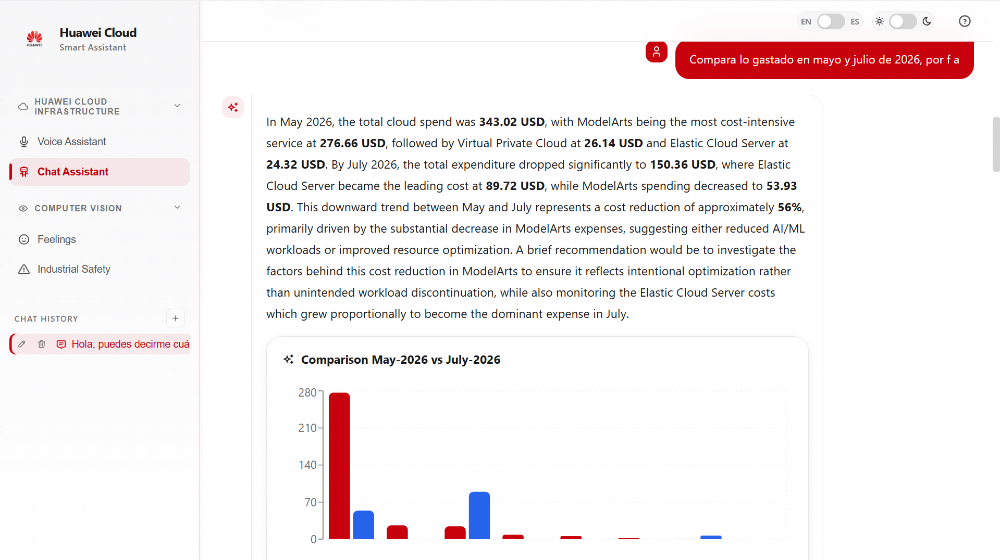
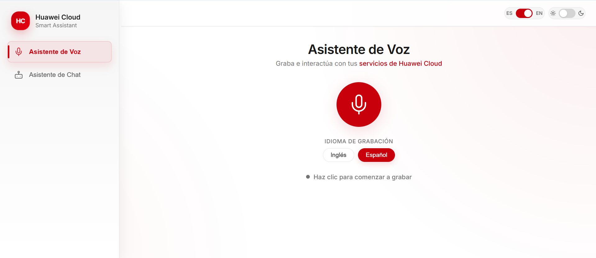
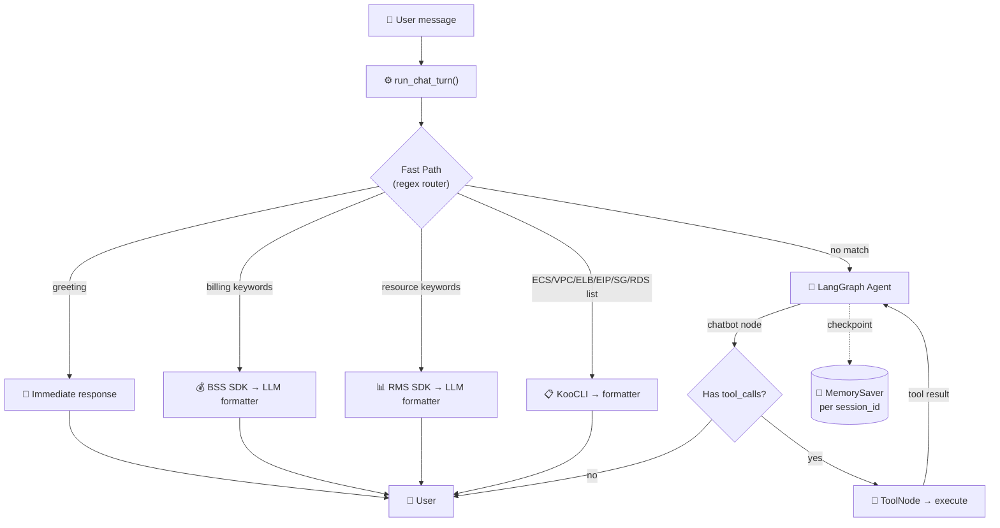
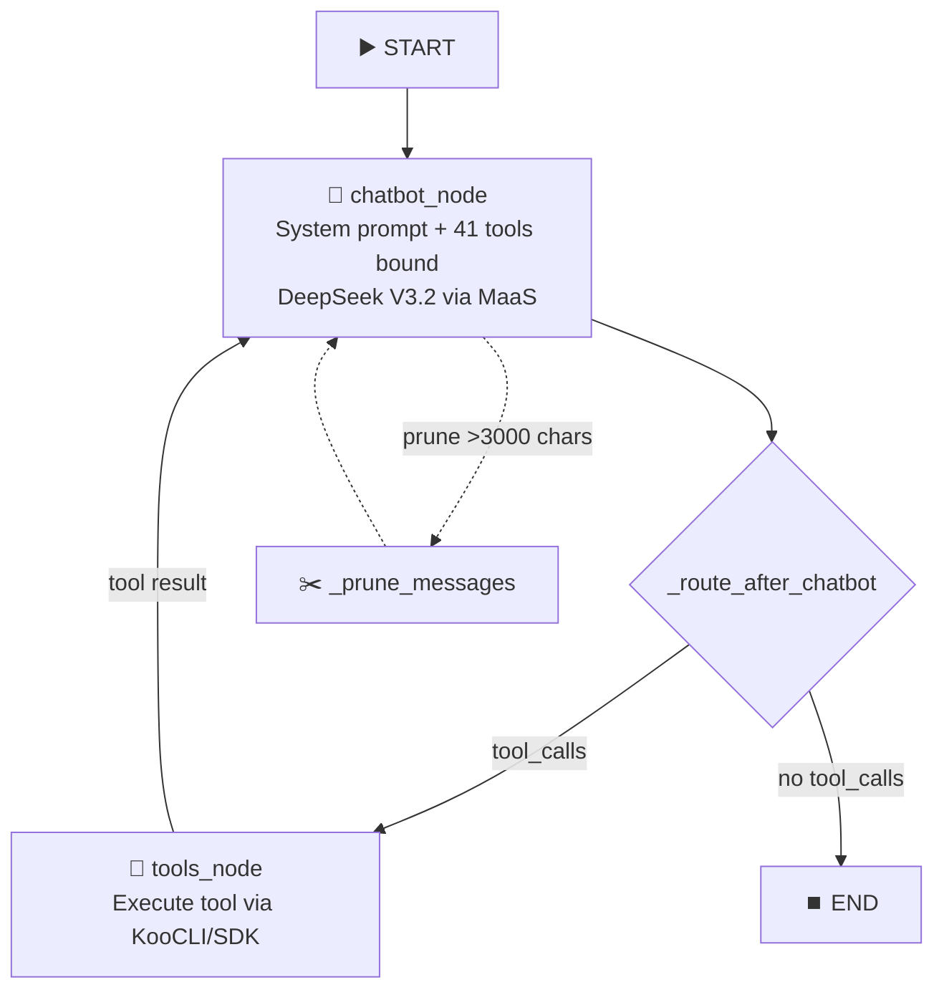
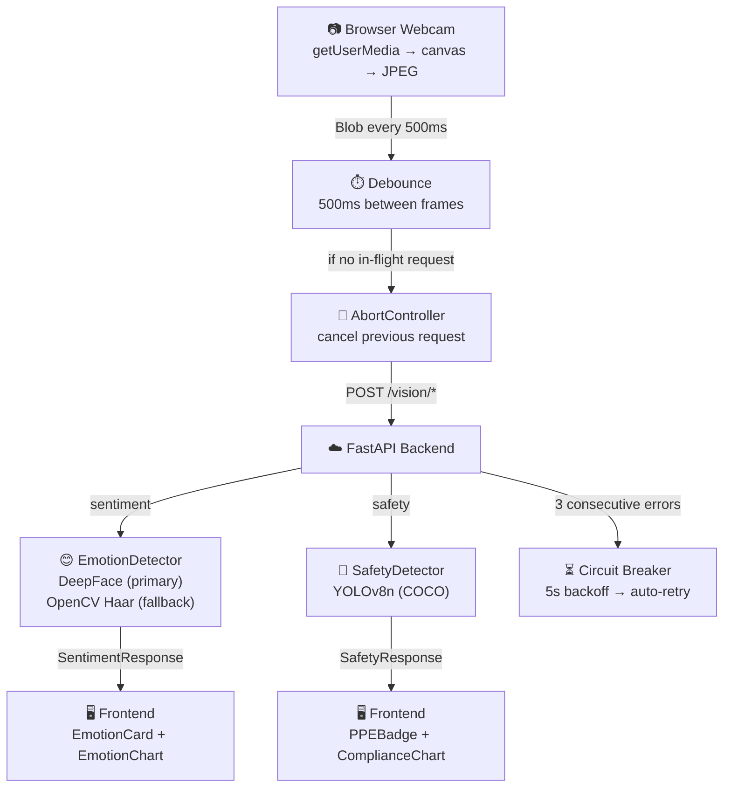

# Huawei Cloud Smart Assistant

> **Status: BETA** — This project is in active development. Some features are experimental, known bugs exist, and parts of the codebase are being refactored. See [Known Issues](#known-issues) and [Current Limitations](#current-limitations).

<p align="center">
  
  
</p>

AI-powered Cloud Operations Assistant for **Huawei Cloud**. Interact via **voice** or **chat** to deploy infrastructure, query resources, manage billing, and execute administrative operations — all through natural language in English or Spanish.


---

## Table of Contents

- [Features](#features)
- [Architecture](#architecture)
- [Project Structure](#project-structure)
- [Requirements](#requirements)
- [Installation](#installation)
  - [KooCLI Setup](#koocli-setup)
  - [Whisper Setup](#whisper-setup-optional)
  - [Kokoro TTS Setup](#kokoro-tts-setup-optional)
  - [Vision Dependencies Setup](#vision-dependencies-setup-optional)
- [Environment Variables](#environment-variables)
- [Running the Project](#running-the-project)
- [API Endpoints](#api-endpoints)
- [LangGraph Agent](#langgraph-agent)
- [Tools Reference](#tools-reference)
- [Voice Pipeline](#voice-pipeline)
- [Computer Vision Pipeline](#computer-vision-pipeline)
  - [Sentiment Recognition](#sentiment-recognition)
  - [Industrial Safety Detection](#industrial-safety-detection)
  - [Vision Architecture](#vision-architecture)
  - [Vision Performance & Resilience](#vision-performance--resilience)
- [Huawei Cloud Integration](#huawei-cloud-integration)
- [Models](#models)
- [Performance & Optimization](#performance--optimization)
- [Security](#security)
- [Known Issues](#known-issues)
- [Current Limitations](#current-limitations)
- [Roadmap](#roadmap)
- [Troubleshooting](#troubleshooting)
- [License](#license)

---

## Features

| Category                | Capabilities                                                                     |
| ----------------------- | -------------------------------------------------------------------------------- |
| **Chat Assistant**      | Multi-thread conversations, markdown rendering, inline charts, bilingual (EN/ES) |
| **Voice Assistant**     | Real-time recording, waveform visualization, STT (SIS/Whisper), TTS (Kokoro)     |
| **Sentiment Recognition** | Real-time facial emotion detection via webcam (DeepFace + OpenCV Haar fallback), multi-face support, emotion distribution charts |
| **Industrial Safety**   | Real-time PPE compliance detection via webcam (YOLOv8n), person-to-PPE association, compliance KPIs and charts |
| **Cloud Orchestration** | Deploy ECS, VPC, ELB, EIP, SG, OBS, RDS — full HA infra in one prompt            |
| **Resource Discovery**  | 90+ Huawei Cloud services, dynamic schema registry, operation discovery          |
| **Billing**             | Monthly spend, cost-by-service breakdown, multi-month queries                    |
| **Safety**              | Destructive operation detection, input sanitization, rate limiting               |

---

## Architecture

### Dual-Path Execution

Every user message goes through a **dual-path router**:



The **fast path** handles simple queries (list, billing, greetings) with regex matching — no LLM call needed for routing, only for response formatting. The **LangGraph agent** handles complex multi-step operations (deploy, discover, delete) with full tool access.

### LangGraph Graph



**Key properties:**

- **Max iterations**: 80 (configurable via `MAX_GRAPH_ITERATIONS`)
- **Memory**: `MemorySaver` (in-memory, per `session_id`/`thread_id`)
- **Message pruning**: Tool results >3000 chars are truncated before LLM invocation
- **Rate limiting**: 6 retries with exponential backoff (3s base) on 429 errors
- **Content filter**: ModelArts 81011 errors (sensitive content) auto-retried with safe prompt

---

## Project Structure

```
.
├── .env                              # Environment configuration (DO NOT commit)
├── .gitignore
├── README.md                         # This file
├── package.json                      # Monorepo metadata
│
├── backend/                          # FastAPI + LangGraph backend
│   ├── app.py                        # FastAPI app creation, CORS, router mounting
│   ├── run.py                        # Production server launcher
│   ├── debug.py                      # Debug script for direct chat invocation
│   ├── requirements.txt              # Python dependencies
│   │
│   ├── agents/                       # LangGraph agent
│   │   ├── graph.py                  # StateGraph definition, MemorySaver, compilation
│   │   ├── nodes.py                  # chatbot_node: LLM invocation, tool binding, pruning
│   │   └── prompts.py               # System prompt (Cloud Architect persona)
│   │
│   ├── api/                          # API layer
│   │   ├── chat.py                   # Core chat orchestrator: run_chat_turn()
│   │   ├── deps.py                   # FastAPI dependency injection
│   │   └── routes/                   # Endpoint definitions
│   │       ├── health.py             # GET /health, GET /metrics
│   │       ├── chat.py               # POST /chat
│   │       ├── voice.py              # POST /voice, POST /transcribe
│   │       └── vision.py             # POST /vision/sentiment, /vision/safety, GET /vision/status
│   │
│   ├── tools/                        # LangChain tools (41 registered)
│   │   ├── registry.py               # ToolRegistry singleton, ToolMeta, ToolCategory
│   │   ├── deploy.py                 # Deploy tools: ECS, ELB, EIP, OBS
│   │   ├── koocli.py                 # Generic run_koocli_command tool
│   │   ├── discovery.py              # (deprecated stub)
│   │   ├── services_ecs.py           # ECS: list, describe, start, stop, reboot
│   │   ├── services_vpc.py           # VPC: list, describe, create, list_subnets
│   │   ├── services_elb.py           # ELB: list, describe
│   │   ├── services_eip.py           # EIP: list, create, associate, release
│   │   ├── services_sg.py            # SG: list, describe
│   │   ├── services_ims.py           # IMS: list_images, find_image_id, resolve_image_name
│   │   ├── services_rds.py           # RDS: list, create, delete, datastores, flavors, backups, logs
│   │   ├── services_resources.py     # RMS: list_resources (all account resources)
│   │   ├── services_billing.py       # BSS: get_monthly_costs, get_cost_by_service
│   │   ├── services_discovery.py     # Service/operation/schema discovery
│   │   ├── common/                   # Shared tool utilities
│   │   │   ├── koocli_runner.py      # Cached KooCLI execution
│   │   │   └── result.py             # ToolResult dataclass
│   │   └── services/                 # Lightweight alt. tool implementations
│   │
│   ├── koocli/                       # KooCLI (hcloud) integration
│   │   ├── executor.py               # Subprocess execution, timeout, output truncation
│   │   ├── params.py                 # flatten_params, build_cli_args, RepeatFlag
│   │   └── regions.py                # Region/project ID resolution, domain_id mapping
│   │
│   ├── orchestration/                # Fast path orchestration
│   │   ├── router.py                 # Regex intent classification
│   │   ├── runner.py                 # Fast path executor
│   │   ├── formatter.py              # Natural language response formatting
│   │   ├── llm_formatter.py          # LLM-based response formatting
│   │   └── lang_context.py           # Per-request language ContextVar
│   │
│   ├── services/                     # Business logic services
│   │   ├── billing.py                # Huawei BSS SDK billing queries
│   │   ├── resources.py              # Huawei RMS SDK resource inventory
│   │   ├── intent.py                 # (deprecated)
│   │   ├── voice/                    # Voice pipeline services
│   │   │   ├── audio.py              # Audio upload validation & ffmpeg conversion
│   │   │   ├── sis.py                # Huawei SIS STT (Speech Intelligence Service)
│   │   │   ├── whisper.py            # Whisper ASR for Spanish transcription
│   │   │   └── tts.py                # Kokoro TTS (OpenAI-compatible API)
│   │   └── vision/                   # Computer vision services
│   │       ├── __init__.py           # Package exports
│   │       ├── emotion_detector.py   # DeepFace + OpenCV Haar emotion detection
│   │       ├── sentiment_service.py  # Sentiment service layer (latency, formatting)
│   │       ├── safety_detector.py    # YOLOv8n PPE compliance detection
│   │       └── safety_service.py     # Safety service layer (latency, formatting)
│   │
│   ├── schemas/                      # API schema registry
│   │   ├── loader.py                 # JSON schema loader
│   │   ├── registry.py               # ServiceRegistry singleton
│   │   └── data/                     # 90+ Huawei Cloud service JSON schemas
│   │       ├── _index.json
│   │       ├── ECS.json, VPC.json, ELB.json, EIP.json
│   │       ├── BSSINTL.json, RMS.json, IAM.json
│   │       └── ... (90+ more)
│   │
│   ├── cloud/                        # Cloud response infrastructure
│   │   ├── result.py                 # CloudResult dataclass
│   │   ├── cache.py                  # Thread-safe TTL cache (LRU, 200 entries)
│   │   └── validation.py             # Response validation, JSON/ID extraction
│   │
│   ├── models/                       # Data models
│   │   ├── schemas.py                # Pydantic models (ChatRequest, ChatResponse, SentimentResponse, SafetyResponse, etc.)
│   │   └── state.py                  # LangGraph AgentState TypedDict
│   │
│   ├── config/                       # Configuration
│   │   ├── settings.py               # Pydantic Settings from .env
│   │   └── logging.py                # Structured JSON logging (prod) / dev formatter
│   │
│   ├── observability/                # Tracing & metrics
│   │   └── __init__.py               # Tracer, Span, Metrics, MetricsCollector
│   │
│   ├── auth/                         # Credential management
│   │   └── credentials.py            # AK/SK/region accessor + validation
│   │
│   ├── validators/                   # Security & parameter validation
│   │   ├── security.py               # Destructive operation detection
│   │   └── params.py                 # Required parameter validation
│   │
│   ├── memory/                       # (deprecated — MemorySaver is in agents/graph.py)
│   ├── utils/                        # Utilities
│   │   ├── sanitize.py               # Input sanitization, model reply cleanup
│   │   └── retry.py                  # Generic retry with exponential backoff
│   └── tests/                        # Test suite
│
├── frontend/                         # React 18 + Vite frontend
│   ├── index.html                    # Entry HTML (Inter font, Huawei favicon)
│   ├── vite.config.js                # Vite config (port 5173)
│   ├── tailwind.config.js            # Tailwind v4 + Huawei brand palette
│   ├── postcss.config.js
│   ├── package.json
│   └── src/
│       ├── main.jsx                  # React entry
│       ├── App.jsx                   # Orchestrator: voice/chat views, threads, i18n, theming
│       ├── styles.css                # Global styles (2214 lines, light/dark themes)
│       ├── components/
│       │   ├── Sidebar.jsx           # Navigation + thread list
│       │   ├── ChatView.jsx          # Chat messages, markdown, charts
│       │   ├── ChatInput.jsx         # Text input bar
│       │   ├── ChatComponents.jsx    # Bubble, typing indicator, empty state
│       │   ├── VoiceView.jsx         # Mic button, waveform, results
│       │   ├── ComputerVisionView.jsx # Vision mode router (sentiment/safety)
│       │   ├── MarkdownRenderer.jsx  # react-markdown + syntax highlighting
│       │   ├── ShimmerLoader.jsx
│       │   ├── ScrollToBottom.jsx
│       │   ├── vision/               # Computer vision components
│       │   │   ├── SentimentRecognition.tsx  # Sentiment orchestrator (debounce, abort, backoff)
│       │   │   ├── SafetyDetection.tsx       # Safety orchestrator (same pattern)
│       │   │   ├── WebcamFeed.tsx            # Reusable webcam capture + frame emission
│       │   │   ├── EmotionCard.tsx           # Emotion display + status card
│       │   │   ├── EmotionChart.tsx          # Emotion distribution bar chart (Recharts)
│       │   │   ├── PPEBadge.tsx             # PPE status grid + person compliance list
│       │   │   └── ComplianceChart.tsx      # PPE counts bar chart (Recharts)
│       │   ├── ui/                   # shadcn-style components
│       │   │   ├── Button.jsx, Input.jsx, Card.jsx
│       │   │   ├── Badge.jsx, Spinner.jsx, ScrollArea.jsx
│       │   │   └── lib/utils.js     # cn() = clsx + twMerge
│       │   └── lib/
│       └── services/
│           └── api.js                # API client (sendChatMessage, sendVoiceAudio, analyzeSentiment, analyzeSafety)
│
└── EJEMPLOS_INTERACCION.md           # Interaction examples (ES)
```

---

## Requirements

| Requirement         | Version | Required For                      |
| ------------------- | ------- | --------------------------------- |
| **Python**          | 3.12    | Backend (3.14 incompatible with TensorFlow) |
| **Node.js**         | 18+     | Frontend                          |
| **KooCLI (hcloud)** | Latest  | All cloud operations              |
| **ffmpeg**          | Any     | Voice transcription (SIS/Whisper) |
| **Git**             | Any     | Cloning the repo                  |

Optional:

| Requirement            | Purpose                                       |
| ---------------------- | --------------------------------------------- |
| **Whisper ASR server** | Local STT (alternative to Huawei SIS)         |
| **Kokoro TTS server**  | Text-to-speech for voice responses            |
| **GPU + CUDA**         | Accelerated Whisper transcription             |
| **Docker**             | Containerized deployment (not yet configured) |
| **DeepFace**           | Facial emotion analysis (pip install deepface) |
| **OpenCV**             | Face detection fallback (pip install opencv-python-headless) |
| **YOLOv8 (ultralytics)** | PPE/object detection (pip install ultralytics) |
| **TensorFlow**         | Required by DeepFace backend                  |

---

## Installation

### 1. Clone the Repository

```bash
git clone <repository-url>
cd Huawei-Cloud-Smart-Assistant
```

### 2. Environment Configuration

Create a `.env` file in the project root. See [Environment Variables](#environment-variables) for the full reference.

```env
# ────────────── Huawei Cloud Credentials ──────────────
HUAWEI_REGION=ap-southeast-3
HUAWEI_PROJECT_ID=your_project_id
HUAWEI_PROJECT_ID_SIS=your_project_id
HUAWEI_AK=your_access_key_id
HUAWEI_SK=your_secret_access_key
CLOUD_SDK_DOMAIN_ID=your_domain_id

# ────────────── IAM (for SIS voice transcription) ──────────────
HUAWEI_IAM_ENDPOINT=https://iam.ap-southeast-3.myhuaweicloud.com
HUAWEI_SIS_ENDPOINT=https://sis-ext.ap-southeast-3.myhuaweicloud.com
HUAWEI_USERNAME=your_iam_username
HUAWEI_DOMAIN_NAME=your_domain_name
HUAWEI_PASSWORD=your_iam_password

# ────────────── SIS Config ──────────────
SIS_PROPERTY=english_16k_common
SIS_ADD_PUNC=yes
SIS_DIGIT_NORM=yes
SIS_NEED_WORD_INFO=no

# ────────────── MaaS (LLM via ModelArts) ──────────────
MAAS_API_KEY=your_maas_api_key
MAAS_API_URL=https://api-ap-southeast-1.modelarts-maas.com/v2/chat/completions
OPEN_API_BASE=https://api-ap-southeast-1.modelarts-maas.com/openai/v1

# ────────────── Backend (FastAPI) ──────────────
APP_NAME=Huawei Smart Assistant
APP_ENV=local
BACKEND_CORS_ORIGINS=http://localhost:5173
BACKEND_PORT=8000
MAX_UPLOAD_MB=5
TEMP_DIR=tmp_audio

# ────────────── Frontend ──────────────
VITE_API_BASE_URL=http://localhost:8000
WHISPER_ASR_URL=http://localhost:9000/asr

# ────────────── Kokoro TTS ──────────────
KOKORO_SPEECH_URL=http://localhost:8880/v1/audio/speech
KOKORO_VOICE_ES=af_heart
KOKORO_VOICE_EN=af_bella
KOKORO_LANG_CODE_ES=es
KOKORO_LANG_CODE_EN=en-us
KOKORO_RESPONSE_FORMAT=mp3
KOKORO_SPEED=1.0
KOKORO_TIMEOUT=30
KOKORO_MAX_RETRIES=2
```

> **Warning**: Never commit `.env` to version control. The `.gitignore` excludes it.

### 3. Backend Setup

```bash
cd backend

# Create virtual environment
python -m venv .venv

# Activate (Windows)
.venv\Scripts\activate
# Activate (Linux/Mac)
# source .venv/bin/activate

# Install dependencies
pip install -r requirements.txt

python app.py
```

### 4. Frontend Setup

```bash
cd frontend
npm install

npm run build

npm run dev
```

### KooCLI Setup

KooCLI (`hcloud`) is **required** for all cloud operations. The backend executes `hcloud` commands via subprocess.

1. **Download**: [KooCLI Installation Guide](https://support.huaweicloud.com/intl/en-us/qs-hcli/hcli_02_003.html)

2. **Authenticate**:

```bash
hcloud configure set --cli-access-key=YOUR_AK --cli-secret-key=YOUR_SK --cli-region=ap-southeast-3
```

3. **Verify**:

```bash
hcloud ECS NovaListServers --cli-region=ap-southeast-3
```

4. **Ensure `hcloud` is in PATH**: The backend searches for `hcloud`/`hcloud.exe` in:
   - System `PATH`
   - `<project_root>/bin/`
   - `<project_root>/`
   - `~/Downloads/huaweicloud-cli-windows-amd64/`

> **Tip**: On Windows, place `hcloud.exe` in the project root or `bin/` directory.

### Whisper Setup (Optional)

For local speech-to-text as an alternative to Huawei SIS:

1. **Install ffmpeg** (required for audio conversion):
   - Windows: `winget install ffmpeg` or download from [ffmpeg.org](https://ffmpeg.org)
   - Linux: `sudo apt install ffmpeg`

2. **Run the Whisper ASR server** (e.g., [whisper-asr-webservice](https://github.com/ahmetoner/whisper-asr-webservice)):

```bash
docker run -d -p 9000:9000 onerahmet/openai-whisper-asr-webservice:latest
```

3. **Configure** in `.env`:

```env
WHISPER_ASR_URL=http://localhost:9000/asr
```

### Kokoro TTS Setup (Optional)

For text-to-speech voice responses:

1. **Run the Kokoro TTS server** (OpenAI-compatible endpoint):

```bash
# Example: run Kokoro TTS on port 8880
python -m kokoro_server --port 8880
```

2. **Configure** in `.env`:

```env
KOKORO_SPEECH_URL=http://localhost:8880/v1/audio/speech
```

The backend calls this endpoint with an OpenAI-compatible payload:

```json
{
  "model": "kokoro",
  "input": "Response text here",
  "voice": "af_heart",
  "response_format": "mp3",
  "speed": 1.0
}
```

### Vision Dependencies Setup (Optional)

The computer vision features (Sentiment Recognition and Industrial Safety) require additional ML libraries. The backend uses **lazy imports** — it starts successfully even without these libraries, and gracefully returns `"unavailable"` status when vision endpoints are called.

#### Sentiment Recognition (Emotion Detection)

```bash
# Primary backend: DeepFace (full 7-emotion classification)
pip install deepface

# DeepFace requires TensorFlow; install tf-keras for TF 2.21+ compatibility
pip install tf-keras

# Fallback backend: OpenCV Haar cascades (face detection only, no emotion classification)
pip install opencv-python-headless numpy
```

> **Important**: Use **Python 3.12**, not 3.14. TensorFlow (required by DeepFace) is incompatible with Python 3.14.

If DeepFace is unavailable, the system falls back to **OpenCV Haar cascades** which can detect faces but cannot classify emotions (returns `"neutral"` with 100% confidence for each detected face).

#### Industrial Safety (PPE Detection)

```bash
# YOLOv8n for object/PPE detection
pip install ultralytics
```

This downloads the `yolov8n.pt` COCO-pretrained model (~6 MB) on first use. The model detects 80 COCO classes including `"person"`, `"hardhat"`, and other objects.

> **Note**: The COCO-pretrained YOLOv8n model has limited PPE detection accuracy. For production use, consider fine-tuning on a PPE-specific dataset (e.g., from [Roboflow Universe](https://universe.roboflow.com)).

---

## Environment Variables

| Variable                 | Description                            | Example                                                             | Required    |
| ------------------------ | -------------------------------------- | ------------------------------------------------------------------- | ----------- |
| `HUAWEI_REGION`          | Default Huawei Cloud region            | `ap-southeast-3`                                                    | Yes         |
| `HUAWEI_PROJECT_ID`      | Project ID for API calls               | `c03f2d01...`                                                       | Yes         |
| `HUAWEI_PROJECT_ID_SIS`  | Project ID for SIS voice               | `c03f2d01...`                                                       | For voice   |
| `HUAWEI_AK`              | Access Key ID                          | `HPUAJIZE...`                                                       | Yes         |
| `HUAWEI_SK`              | Secret Access Key                      | `wE0Md6x1...`                                                       | Yes         |
| `CLOUD_SDK_DOMAIN_ID`    | Domain ID for RMS SDK                  | `37300593...`                                                       | For RMS     |
| `HUAWEI_IAM_ENDPOINT`    | IAM endpoint for token auth            | `https://iam.ap-southeast-3.myhuaweicloud.com`                      | For SIS     |
| `HUAWEI_SIS_ENDPOINT`    | SIS endpoint for STT                   | `https://sis-ext.ap-southeast-3.myhuaweicloud.com`                  | For SIS     |
| `HUAWEI_USERNAME`        | IAM username                           | `bs_dev_J50026714`                                                  | For SIS     |
| `HUAWEI_DOMAIN_NAME`     | IAM domain name                        | `bs_dev_J50026714`                                                  | For SIS     |
| `HUAWEI_PASSWORD`        | IAM password                           | `Huawei@123!`                                                       | For SIS     |
| `SIS_PROPERTY`           | SIS recognition property               | `english_16k_common`                                                | No          |
| `SIS_ADD_PUNC`           | Add punctuation to SIS output          | `yes`                                                               | No          |
| `SIS_DIGIT_NORM`         | Digit normalization                    | `yes`                                                               | No          |
| `SIS_NEED_WORD_INFO`     | Word-level timing info                 | `no`                                                                | No          |
| `MAAS_API_KEY`           | ModelArts API key                      | `oJM6F66Us...`                                                      | Yes         |
| `MAAS_API_URL`           | ModelArts chat completions URL         | `https://api-ap-southeast-1.modelarts-maas.com/v2/chat/completions` | Yes         |
| `OPEN_API_BASE`          | OpenAI-compatible base URL             | `https://api-ap-southeast-1.modelarts-maas.com/openai/v1`           | Yes         |
| `APP_NAME`               | Application display name               | `Huawei Smart Assistant`                                            | No          |
| `APP_ENV`                | Environment: `local` or `production`   | `local`                                                             | No          |
| `BACKEND_CORS_ORIGINS`   | Allowed CORS origins (comma-separated) | `http://localhost:5173`                                             | No          |
| `BACKEND_PORT`           | Backend server port                    | `8000`                                                              | No          |
| `MAX_UPLOAD_MB`          | Max audio upload size (MB)             | `5`                                                                 | No          |
| `TEMP_DIR`               | Temporary audio directory              | `tmp_audio`                                                         | No          |
| `VITE_API_BASE_URL`      | Frontend API base URL                  | `http://localhost:8000`                                             | No          |
| `WHISPER_ASR_URL`        | Whisper ASR endpoint                   | `http://localhost:9000/asr`                                         | For Whisper |
| `KOKORO_SPEECH_URL`      | Kokoro TTS endpoint                    | `http://localhost:8880/v1/audio/speech`                             | For TTS     |
| `KOKORO_VOICE_ES`        | Spanish TTS voice                      | `af_heart`                                                          | No          |
| `KOKORO_VOICE_EN`        | English TTS voice                      | `af_bella`                                                          | No          |
| `KOKORO_LANG_CODE_ES`    | Spanish language code                  | `es`                                                                | No          |
| `KOKORO_LANG_CODE_EN`    | English language code                  | `en-us`                                                             | No          |
| `KOKORO_RESPONSE_FORMAT` | Audio format                           | `mp3`                                                               | No          |
| `KOKORO_SPEED`           | Speech speed multiplier                | `1.0`                                                               | No          |
| `KOKORO_TIMEOUT`         | TTS request timeout (seconds)          | `30`                                                                | No          |
| `KOKORO_MAX_RETRIES`     | TTS retry count                        | `2`                                                                 | No          |

---

## Running the Project

### Backend (Development)

```bash
cd backend
.venv\Scripts\activate          # Windows
# source .venv/bin/activate     # Linux/Mac

python -m uvicorn app:app --app-dir backend --reload --host 0.0.0.0 --port 8000
```

The backend runs at **http://localhost:8000**.

### Backend (Production)

```bash
cd backend
python run.py
```

This uses `uvicorn` without `--reload` and reads `BACKEND_PORT` from `.env`.

### Frontend

```bash
cd frontend
npm run dev
```

Access at **http://localhost:5173**.

> **Important**: Ensure `VITE_API_BASE_URL` in `.env` matches the backend URL (`http://localhost:8000`).

---

## API Endpoints

### Chat

```
POST /chat
```

| Field        | Type   | Description                              |
| ------------ | ------ | ---------------------------------------- |
| `message`    | string | User message (required, min 1 char)      |
| `session_id` | string | Persistent session identifier (required) |

**Response:**

```json
{
  "session_id": "session-abc123",
  "reply": "Your ECS instances: ...",
  "raw_messages": [...],
  "latency_ms": 154603,
  "tool_calls": 16,
  "path": "llm"
}
```

The `path` field indicates routing: `"fast"` (regex fast path) or `"llm"` (LangGraph agent).

### Voice

```
POST /voice
```

| Field        | Type       | Description                        |
| ------------ | ---------- | ---------------------------------- |
| `file`       | UploadFile | Audio file (WAV/MP3/WebM, max 5MB) |
| `language`   | string     | `en` or `es`                       |
| `session_id` | string     | Session identifier                 |

**Response:**

```json
{
  "transcription": "Show me my ECS instances",
  "reply": "You have 2 ECS instances...",
  "audio_base64": "dGhpcyBpcyBhbiBtcDMg...",
  "latency_ms": 3200
}
```

### Transcribe (STT only)

```
POST /transcribe
```

Returns only the transcription without LLM processing.

### Health

```
GET /health
```

```json
{
  "status": "ok",
  "app_name": "Huawei Smart Assistant",
  "env": "local"
}
```

### Metrics

```
GET /metrics
```

Returns observability metrics: request counts, latency, cache hit rates, tool call counts, error rates.

### Vision Status

```
GET /vision/status
```

```json
{
  "sentiment_backend": "deepface",
  "safety_available": true,
  "deepface_available": true,
  "opencv_available": true
}
```

| Field                 | Description                                                    |
| --------------------- | -------------------------------------------------------------- |
| `sentiment_backend`   | Active sentiment backend: `"deepface"`, `"opencv-haar"`, or `"unavailable"` |
| `safety_available`    | Whether YOLOv8 model loaded successfully                       |
| `deepface_available`  | Whether DeepFace library is importable                         |
| `opencv_available`    | Whether OpenCV is available (true if either backend works)     |

### Sentiment Analysis (File Upload)

```
POST /vision/sentiment
```

| Field  | Type       | Description                    |
| ------ | ---------- | ------------------------------ |
| `file` | UploadFile | JPEG/PNG image frame (required)|

**Response:**

```json
{
  "status": "success",
  "dominant_emotion": "happy",
  "confidence": 92.5,
  "all_scores": { "happy": 92.5, "sad": 1.2, "angry": 0.3, "fear": 0.8, "surprise": 2.1, "disgust": 0.5, "neutral": 2.6 },
  "faces": [{ "dominant_emotion": "happy", "confidence": 92.5, "face_index": 0 }],
  "face_count": 1,
  "latency_ms": 340
}
```

### Sentiment Analysis (Base64)

```
POST /vision/sentiment/base64
```

| Field   | Type   | Description                        |
| ------- | ------ | ---------------------------------- |
| `image` | string | Base64-encoded image (form field)  |

Returns the same `SentimentResponse` as the file upload endpoint.

### Safety Analysis (PPE Detection)

```
POST /vision/safety
```

| Field  | Type       | Description                    |
| ------ | ---------- | ------------------------------ |
| `file` | UploadFile | JPEG/PNG image frame (required)|

**Response:**

```json
{
  "status": "success",
  "total_persons": 3,
  "compliant_persons": 2,
  "compliance_rate": 66.7,
  "persons": [
    {
      "person_index": 0,
      "compliant": true,
      "missing_ppe": [],
      "ppe": [{ "class_name": "hardhat", "confidence": 0.87 }, { "class_name": "safety_vest", "confidence": 0.82 }],
      "ppe_classes": ["hardhat", "safety_vest"]
    }
  ],
  "all_detections": [{ "class_name": "person", "confidence": 0.95, "bbox": [120, 50, 300, 400] }],
  "ppe_summary": { "hardhat": 2, "safety_vest": 2 },
  "latency_ms": 180
}
```

---

## LangGraph Agent

### Agent State

```python
class AgentState(TypedDict):
    messages: Annotated[list[BaseMessage], add_messages]  # conversation history
    intent: Optional[str]         # detected intent
    service: Optional[str]        # target cloud service
    execution_result: Optional[str]  # tool execution result
    error: Optional[str]          # error message
```

### Execution Pipeline

1. **User message** arrives at `POST /chat`
2. `run_chat_turn()` detects language, tries fast path
3. If fast path returns `None`, streams through LangGraph:
   - `chatbot_node`: Prepends system prompt, prunes long tool results, invokes LLM with all 41 tools bound
   - If LLM returns `tool_calls` → routes to `ToolNode` → executes tool → returns to `chatbot_node`
   - If LLM returns text only → routes to `END`
4. Final AI message extracted and returned

### System Prompt Rules

| Rule                   | Description                                                           |
| ---------------------- | --------------------------------------------------------------------- |
| **Anti-hallucination** | Never invent data; always use tools for real information              |
| **No explanations**    | Don't say "I'll check..." — just execute                              |
| **No repeated work**   | Don't re-verify completed operations                                  |
| **Response style**     | Brief, same language as user, `<strong>` for key data only            |
| **List vs Deploy**     | Use list tools for inventory, deploy tools for creation               |
| **Resource memory**    | Remember created resource IDs for the conversation                    |
| **Default values**     | Region `la-north-2`, flavor `s6.small.1`, image auto-resolved via IMS |

---

## Tools Reference

41 tools are registered at startup across 12 service groups:

### Query Tools (Read-Only)

| Tool                      | Service | Description                             |
| ------------------------- | ------- | --------------------------------------- |
| `list_ecs`                | ECS     | List all ECS instances                  |
| `describe_ecs`            | ECS     | Get details of a specific ECS           |
| `list_vpcs`               | VPC     | List all VPCs                           |
| `describe_vpc`            | VPC     | Get VPC details                         |
| `list_subnets`            | VPC     | List subnets in a VPC                   |
| `list_elb`                | ELB     | List load balancers                     |
| `describe_elb`            | ELB     | Get ELB details                         |
| `list_eips`               | EIP     | List elastic IPs                        |
| `list_security_groups`    | SG      | List security groups                    |
| `describe_security_group` | SG      | Get security group details              |
| `list_images`             | IMS     | List IMS images (private/public/shared) |
| `find_image_id`           | IMS     | Find image ID by name (exact/partial)   |
| `list_rds`                | RDS     | List RDS instances                      |
| `list_rds_datastores`     | RDS     | List DB engine versions                 |
| `list_rds_flavors`        | RDS     | List RDS flavor specs (CPU/RAM)         |
| `list_rds_storage_types`  | RDS     | List available storage types            |
| `list_rds_backups`        | RDS     | List RDS backups                        |
| `list_rds_error_logs`     | RDS     | List RDS error logs                     |
| `list_rds_slow_logs`      | RDS     | List slow query logs                    |
| `list_resources`          | RMS     | List all cloud resources (account-wide) |
| `get_monthly_costs`       | BSS     | Get monthly billing summary             |
| `get_cost_by_service`     | BSS     | Get cost breakdown by service           |

### Management Tools

| Tool                | Service | Description                      |
| ------------------- | ------- | -------------------------------- |
| `start_ecs`         | ECS     | Start an ECS instance            |
| `stop_ecs`          | ECS     | Stop an ECS instance             |
| `reboot_ecs`        | ECS     | Reboot an ECS instance           |
| `create_vpc`        | VPC     | Create a new VPC                 |
| `create_eip`        | EIP     | Create an elastic IP             |
| `associate_eip`     | EIP     | Associate EIP to a resource      |
| `release_eip`       | EIP     | Release an elastic IP            |
| `manage_ecs`        | DEPLOY  | Start/stop/reboot/status ECS     |
| `manage_eip`        | DEPLOY  | Create/associate/show/delete EIP |
| `manage_obs_bucket` | DEPLOY  | Create/delete OBS buckets        |

### Deploy Tools (Multi-Step)

| Tool                  | Description                                                                                                                  |
| --------------------- | ---------------------------------------------------------------------------------------------------------------------------- |
| `deploy_ecs_instance` | Creates ECS with auto-resolved VPC/subnet/image/AZ, optional SG. Image names (e.g. `ims-web`) auto-resolved to UUIDs via IMS |
| `setup_elb_for_ecs`   | Full ELB stack: ELB → Listener → Pool → Members → EIP. Supports multiple ECS via comma-separated names/IDs                   |
| `create_rds_instance` | Creates RDS with auto-resolved VPC/subnet/SG/AZ, configurable engine/version/flavor/volume. Waits for ACTIVE status          |
| `delete_rds_instance` | Deletes an RDS instance by ID                                                                                                |

### Discovery Tools

| Tool                      | Description                                       |
| ------------------------- | ------------------------------------------------- |
| `list_available_services` | Catalog of 90+ Huawei Cloud services              |
| `list_service_operations` | List KooCLI operations for a service              |
| `get_operation_details`   | Get required/optional parameters for an operation |
| `resolve_service_schema`  | Direct schema lookup by service + operation hint  |

### Generic Execution

| Tool                 | Description                                        |
| -------------------- | -------------------------------------------------- |
| `run_koocli_command` | Execute any `hcloud` command (use after discovery) |

---

## Voice Pipeline


### Step-by-Step

1. **Browser** captures audio via `MediaRecorder` API (WebM/Opus format)
2. **ffmpeg** converts to WAV 16kHz mono (required by SIS/Whisper)
3. **STT** transcribes the audio:
   - **Primary**: Huawei SIS (Speech Intelligence Service) — cloud-based, supports English/Chinese
   - **Fallback**: Whisper ASR — local, better Spanish support
4. **Chat Agent** processes the transcription via `run_chat_turn()`
5. **TTS** generates audio response via Kokoro (OpenAI-compatible `/v1/audio/speech` endpoint)
6. **Browser** plays the audio via `<audio>` element

### Language Support

| Language | STT                        | TTS Voice  |
| -------- | -------------------------- | ---------- |
| English  | SIS (`english_16k_common`) | `af_bella` |
| Spanish  | Whisper (recommended)      | `af_heart` |

> **Note**: Huawei SIS doesn't have native Spanish support. For Spanish voice input, Whisper is recommended.

---

## Computer Vision Pipeline

The application includes two real-time computer vision features that process webcam frames and display results live in the UI. Both follow the same architectural pattern for resilience and performance.



### Sentiment Recognition

Real-time facial emotion detection from webcam feed. Supports multiple faces simultaneously.

**How it works:**

1. **WebcamFeed** component captures a JPEG frame every 500ms via hidden canvas (`480×360`, quality 0.8)
2. **SentimentRecognition** orchestrator debounces the frame, aborts any in-flight request, and sends it to `POST /vision/sentiment`
3. **EmotionDetector** (backend) analyzes the frame using one of two backends:
   - **DeepFace** (primary): Full 7-emotion classification (`happy`, `sad`, `angry`, `fear`, `surprise`, `disgust`, `neutral`) with confidence scores. Uses `enforce_detection=False` to avoid exceptions when no face is found.
   - **OpenCV Haar cascade** (fallback): Face detection only via `haarcascade_frontalface_default.xml` with relaxed parameters (`scaleFactor=1.1`, `minNeighbors=3`, histogram equalization, `minSize=8%`). Returns `"neutral"` emotion with 100% confidence for each detected face.
4. **Frontend** displays results as animated `EmotionCard` components (emoji + label + confidence bar) and an `EmotionChart` (horizontal bar chart of all emotion scores via Recharts)

**Multi-face support:** If multiple faces are detected, each face gets its own `EmotionCard` with a face index label. The primary face (index 0) is highlighted.

**Backend selection priority:** DeepFace → OpenCV Haar → `"unavailable"`. The backend is determined lazily on first request and cached.

### Industrial Safety Detection

Real-time PPE (Personal Protective Equipment) compliance detection from webcam feed. Identifies persons and checks if they are wearing required safety equipment.

**How it works:**

1. **WebcamFeed** captures a JPEG frame (same as sentiment)
2. **SafetyDetection** orchestrator sends it to `POST /vision/safety`
3. **SafetyDetector** (backend) runs YOLOv8n inference:
   - Detects all objects in the frame (confidence threshold: 0.35)
   - Separates `"person"` detections from other objects
   - For each person, checks if any non-person detection's **bounding box center** falls inside the person's bounding box — if so, it's considered PPE worn by that person
   - Compares detected PPE against `REQUIRED_PPE = ["hardhat", "safety_vest"]`
   - Computes compliance rate (% of persons with all required PPE)
4. **Frontend** displays:
   - **KPI row**: Total persons, compliant, non-compliant, compliance rate (color-coded: green ≥80%, yellow ≥50%, red <50%)
   - **PPEStatusGrid**: Badge for each PPE type (detected/missing/optional)
   - **PersonComplianceList**: Per-person compliance cards with missing PPE items
   - **ComplianceChart**: Horizontal bar chart of PPE detection counts via Recharts

**PPE-to-person association heuristic:** The center of each detected object's bounding box is checked against each person's bounding box. If the center falls within the person's box, the object is associated as that person's PPE. This is a simple spatial heuristic — not a tracker — and works best when persons are well-separated in the frame.

**Supported PPE classes:** `hardhat`, `helmet`, `safety_vest`, `vest`, `goggles`, `glasses`, `face_shield`, `mask`, `gloves`, `safety_boots`, `boots`. Aliases (e.g., `helmet` → `hardhat`) are mapped automatically.

### Vision Architecture

Both features follow a **3-layer architecture** with lazy initialization:

```
API Route (vision.py)
    │
    ▼
Service Layer (sentiment_service.py / safety_service.py)
    │   • Latency measurement (time.perf_counter)
    │   • Error handling / response formatting
    │   • Base64 decoding
    ▼
Detector Layer (emotion_detector.py / safety_detector.py)
    │   • Lazy backend initialization (_ensure_initialized)
    │   • ML inference (DeepFace / OpenCV / YOLOv8)
    │   • Tempfile for image I/O (required by DeepFace/YOLO APIs)
    ▼
Pydantic Schemas (schemas.py)
    • SentimentResponse, SafetyResponse, FaceEmotion
```

**Frontend component hierarchy:**

```
ComputerVisionView (mode router: "feelings" | "industrial-safety")
  │
  ├── SentimentRecognition (orchestrator)
  │     ├── WebcamFeed (camera + frame capture)
  │     ├── EmotionCard / EmotionStatusCard (presentational)
  │     └── EmotionChart (Recharts bar chart)
  │
  └── SafetyDetection (orchestrator)
        ├── WebcamFeed (reused)
        ├── PPEStatusGrid / PersonComplianceList (presentational)
        └── ComplianceChart (Recharts bar chart)
```

**Conditional rendering:** Vision components are conditionally rendered in `App.jsx` — they **unmount** when the user navigates away, which stops the webcam stream, clears intervals, and prevents unnecessary backend requests. The chat view stays mounted (via `display: none/block`) to preserve input state and scroll position.

### Vision Performance & Resilience

Both orchestrators share identical resilience patterns:

| Pattern               | Implementation                                                                    |
| --------------------- | --------------------------------------------------------------------------------- |
| **Frame debounce**    | 500ms minimum between sent frames (`DEBOUNCE_MS`)                                |
| **Request abort**     | `AbortController` cancels in-flight request when a new frame is ready             |
| **Circuit breaker**   | After 3 consecutive errors (`MAX_CONSECUTIVE_ERRORS`), marks backend as down     |
| **Auto-backoff**      | 5s wait (`BACKOFF_MS`) after circuit breaker trips, then auto-retries            |
| **Result gating**     | `hasResultRef` — once first successful result arrives, never show "analyzing" again |
| **Lazy ML init**      | Backend imports ML libraries on first request, not at startup                    |
| **Graceful fallback** | Missing libraries → `"unavailable"` status, not crash                            |
| **Temp file cleanup** | `finally` blocks ensure temp image files are deleted after inference              |

---

## Huawei Cloud Integration

### How It Works

All cloud operations go through **KooCLI** (`hcloud`), Huawei Cloud's official CLI. The backend:

1. Builds CLI arguments from Python dicts using `flatten_params()` (recursive dot-notation: `--server.nics.1.subnet_id="xxx"`)
2. Injects credentials (`--cli-access-key`, `--cli-secret-key`, `--cli-region`, `--project_id`)
3. Executes `hcloud` via `subprocess.run()` with configurable timeout
4. Parses and validates the JSON response

### Supported Services

The schema registry includes **90+ Huawei Cloud services**. Key services with dedicated tools:

| Service | Operations                                                                                | Dedicated Tools                                                   |
| ------- | ----------------------------------------------------------------------------------------- | ----------------------------------------------------------------- |
| **ECS** | CreatePostPaidServers, NovaListServers, ShowServer, DeleteServers, BatchStart/Stop/Reboot | `deploy_ecs_instance`, `list_ecs`, `describe_ecs`, `manage_ecs`   |
| **VPC** | CreateVpc, CreateSubnet, CreateSecurityGroup, CreateSecurityGroupRule                     | `create_vpc`, `list_vpcs`, `list_subnets`, `list_security_groups` |
| **ELB** | CreateLoadBalancer, CreateListener, CreatePool, BatchCreateMembers                        | `setup_elb_for_ecs`, `list_elb`, `describe_elb`                   |
| **EIP** | CreatePublicip, AssociatePublicips, ShowPublicip, DeletePublicip                          | `manage_eip`, `list_eips`                                         |
| **IMS** | ListImages                                                                                | `list_images`, `find_image_id`, `resolve_image_name`              |
| **RDS** | CreateInstance, DeleteInstance, ListInstances, ListDatastores, ListFlavors, ListBackups   | `create_rds_instance`, `delete_rds_instance`, `list_rds`, ...     |
| **OBS** | `obs mb`, `obs rm` (via hcloud obs subcommand)                                            | `manage_obs_bucket`                                               |
| **BSS** | ShowCustomerMonthlySum (via Python SDK)                                                   | `get_monthly_costs`, `get_cost_by_service`                        |
| **RMS** | ListAllResources (via Python SDK)                                                         | `list_resources`                                                  |

For any other service, use the discovery flow: `list_available_services` → `list_service_operations` → `get_operation_details` → `run_koocli_command`.

---

## Models

| Component             | Model                       | Provider                | Notes                               |
| --------------------- | --------------------------- | ----------------------- | ----------------------------------- |
| **Chat/Reasoning**    | `glm-5.1` / `deepseek-v3.2` | Huawei MaaS (ModelArts) | OpenAI-compatible API, main agent   |
| **Intent/Formatting** | `glm-5.1` / `deepseek-v3.2` | Huawei MaaS             | Fast path response formatting       |
| **STT (primary)**     | Huawei SIS                  | Huawei Cloud            | Cloud-based, English/Chinese        |
| **STT (fallback)**    | Whisper                     | Local/self-hosted       | Better Spanish support              |
| **TTS**               | Kokoro                      | Local/self-hosted       | OpenAI-compatible API, EN/ES voices |
| **Emotion Detection** | DeepFace (VGG-Face)         | Local (Python)          | 7-emotion classification, primary   |
| **Face Detection**    | OpenCV Haar Cascades        | Local (Python)          | Face detection only, fallback       |
| **PPE Detection**     | YOLOv8n (COCO)              | Local (Python)          | 80-class object detection, ~6 MB    |

---

## Performance & Optimization

| Feature                | Implementation                                                                        |
| ---------------------- | ------------------------------------------------------------------------------------- |
| **Fast path**          | Regex-based routing for simple queries — no LLM call for routing, only for formatting |
| **Cloud cache**        | Thread-safe TTL cache (30s default, 200 entries, LRU eviction, MD5 keys)              |
| **Message pruning**    | Tool results >3000 chars truncated before LLM invocation                              |
| **Rate limiting**      | 6 retries with exponential backoff (3s base) on 429 errors                            |
| **KooCLI timeout**     | 180s per command (configurable)                                                       |
| **Output truncation**  | KooCLI output capped at 100k chars                                                    |
| **Structured logging** | JSON logs in production, dev-friendly format in local                                 |
| **LLM+tools caching**  | LLM instance and tool bindings cached globally (singleton)                            |

---

## Security

| Aspect                              | Implementation                                                      |
| ----------------------------------- | ------------------------------------------------------------------- |
| **Credentials**                     | AK/SK stored in `.env` (never committed), injected per-command      |
| **Input sanitization**              | All user inputs sanitized (control chars stripped, names validated) |
| **Destructive operation detection** | Delete/destroy/terminate operations flagged with warning logs       |
| **CORS**                            | Configurable allowed origins via `BACKEND_CORS_ORIGINS`             |
| **Upload limits**                   | Max audio upload size configurable via `MAX_UPLOAD_MB`              |
| **IAM auth**                        | Username/password auth for SIS (separate from AK/SK)                |

> **Warning**: This project is designed for development/demo purposes. For production:
>
> - Use IAM roles instead of AK/SK where possible
> - Enable API gateway rate limiting
> - Add authentication to the chat/voice endpoints
> - Use persistent encrypted storage for credentials

---

## Known Issues

| Issue                                                                         | Status | Workaround                                                        |
| ----------------------------------------------------------------------------- | ------ | ----------------------------------------------------------------- |
| `MemorySaver` is in-memory only — conversation history lost on server restart | Known  | Restart sessions after server restart                             |
| Huawei SIS doesn't have Spanish recognition accuracy                          | Known  | Use Whisper for Spanish input                                     |
| LLM may lose context in very long conversations (>50 tool calls)              | Known  | Start a new session for complex deployments                       |
| Dot-notation params may not work for some batch KooCLI operations             | Fixed  | `RepeatFlag` class added for JSON-serialized repeated flags       |
| ELB `BatchCreateMembers` may fail without `subnet_id` per member              | Fixed  | `subnet_id` now extracted from ECS and included in member payload |
| ModelArts 81011 content filter may reject LLM responses with sensitive data   | Fixed  | Auto-retry with safe prompt (no IDs/credentials in output)        |
| KooCLI `--password` collision with system param causes interactive prompt     | Fixed  | `subprocess.run(input="b\n")` auto-answers "API parameter"        |
| YOLOv8n COCO model has limited PPE detection accuracy                         | Known  | Fine-tune on PPE-specific dataset (e.g., Roboflow Universe)      |
| PPE-to-person association uses simple center-point heuristic                  | Known  | Works best with well-separated persons in frame                   |
| OpenCV Haar fallback returns `"neutral"` for all detected faces               | Known  | Install DeepFace for real emotion classification                   |
| DeepFace incompatible with Python 3.14 (TensorFlow limitation)               | Known  | Use Python 3.12                                                  |

---

## Current Limitations

- **No Docker support**: No `Dockerfile` or `docker-compose.yml` yet
- **No authentication on API endpoints**: Anyone with network access can call `/chat` and `/voice`
- **No persistent memory**: `MemorySaver` is volatile — all conversation history lost on restart
- **No RAG**: No retrieval-augmented generation for Huawei Cloud documentation
- **No multi-cloud**: Only Huawei Cloud is supported
- **No streaming responses**: Chat responses are returned as a single payload (no SSE/WebSocket streaming)
- **No concurrent session isolation**: All sessions share the same LLM cache
- **Windows-only testing**: KooCLI subprocess execution tested primarily on Windows
- **No automated test suite**: Tests exist but are not integrated into CI/CD

---

## Roadmap

- [ ] **PPE-specific YOLOv8 model**: Fine-tune on Roboflow Universe PPE dataset for better hardhat/safety_vest detection
- [ ] **Docker support**: `Dockerfile` + `docker-compose.yml` for containerized deployment
- [ ] **Streaming responses**: SSE/WebSocket streaming for chat responses
- [ ] **Persistent memory**: Database-backed conversation history (replace `MemorySaver`)
- [ ] **RAG integration**: Retrieval-augmented generation for Huawei Cloud documentation
- [ ] **API authentication**: JWT/API key auth on chat/voice/vision endpoints
- [ ] **Multi-person PPE tracking**: Track persons across frames for stable compliance reporting
- [ ] **Vision base64 endpoint for safety**: Add `POST /vision/safety/base64` (currently only file upload)

---

## Troubleshooting

### KooCLI Issues

| Problem               | Solution                                                                      |
| --------------------- | ----------------------------------------------------------------------------- |
| `hcloud` not found    | Ensure `hcloud`/`hcloud.exe` is in PATH or project root/bin directory         |
| Authentication failed | Verify `HUAWEI_AK` and `HUAWEI_SK` in `.env` match your Huawei Cloud account  |
| Command timeout       | Increase `KOOLCI_TIMEOUT` in `.env` (default 120s)                            |
| Region not found      | Check `HUAWEI_REGION` — valid regions: `ap-southeast-1/3`, `la-north-2`, etc. |

### Whisper Issues

| Problem                       | Solution                                                         |
| ----------------------------- | ---------------------------------------------------------------- |
| `ffmpeg not found`            | Install ffmpeg and ensure it's in PATH                           |
| Whisper server not responding | Check `WHISPER_ASR_URL` in `.env` and that the server is running |
| Poor Spanish recognition      | Try a larger Whisper model (e.g., `large-v3`)                    |

### Kokoro TTS Issues

| Problem           | Solution                                                        |
| ----------------- | --------------------------------------------------------------- |
| TTS timeout       | Increase `KOKORO_TIMEOUT` (default 30s)                         |
| No audio response | Check `KOKORO_SPEECH_URL` and that the Kokoro server is running |
| Wrong voice       | Verify `KOKORO_VOICE_ES`/`KOKORO_VOICE_EN` settings             |

### Backend Issues

| Problem                  | Solution                                                                    |
| ------------------------ | --------------------------------------------------------------------------- |
| Port already in use      | Change `BACKEND_PORT` in `.env` or kill the process using the port          |
| CORS errors              | Add frontend URL to `BACKEND_CORS_ORIGINS` (comma-separated)                |
| Import errors            | Ensure virtual environment is activated and `requirements.txt` is installed |
| Rate limit (429) errors  | The agent retries automatically (6 attempts). If persistent, wait and retry |
| LangGraph max iterations | Increase `MAX_GRAPH_ITERATIONS` (default 80)                                |

### Frontend Issues

| Problem                | Solution                                                          |
| ---------------------- | ----------------------------------------------------------------- |
| Blank page             | Check browser console for errors; ensure backend is running       |
| API connection refused | Verify `VITE_API_BASE_URL` matches backend URL and port           |
| Voice not working      | Ensure HTTPS or localhost (MediaRecorder requires secure context) |

### Vision Issues

| Problem                                    | Solution                                                                               |
| ------------------------------------------ | -------------------------------------------------------------------------------------- |
| `sentiment_backend: "unavailable"`         | Install DeepFace (`pip install deepface tf-keras`) or OpenCV (`pip install opencv-python-headless`) |
| `safety_available: false`                  | Install ultralytics (`pip install ultralytics`)                                        |
| Webcam permission denied                   | Allow camera access in browser settings; ensure HTTPS or localhost                     |
| No faces detected                          | Ensure good lighting, face clearly visible; Haar cascade is less sensitive than DeepFace |
| PPE not detected (false negatives)         | COCO YOLOv8n has limited PPE classes; consider fine-tuned PPE model from Roboflow     |
| DeepFace import error with Python 3.14     | Use Python 3.12 (TensorFlow incompatibility)                                          |
| `tf-keras` not found                       | Install `pip install tf-keras` (required for DeepFace with TensorFlow 2.21+)           |
| High latency on vision endpoints           | Use GPU + CUDA for YOLOv8; reduce frame capture resolution in WebcamFeed               |
