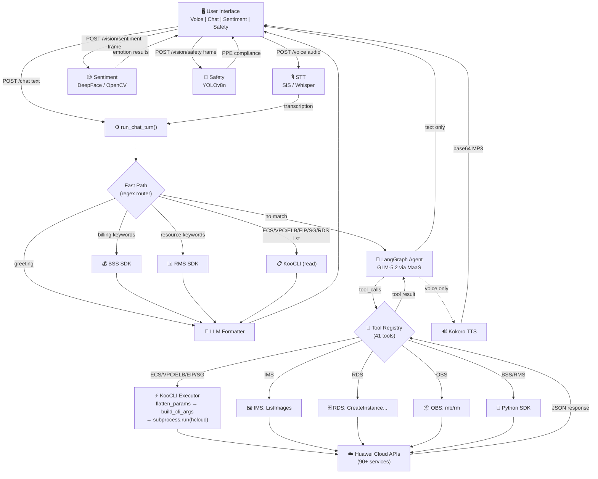
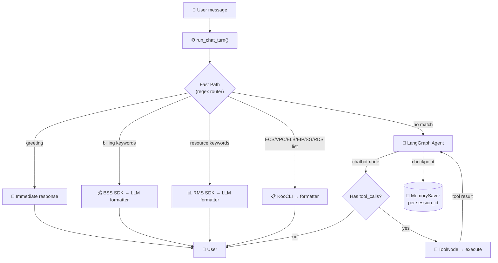
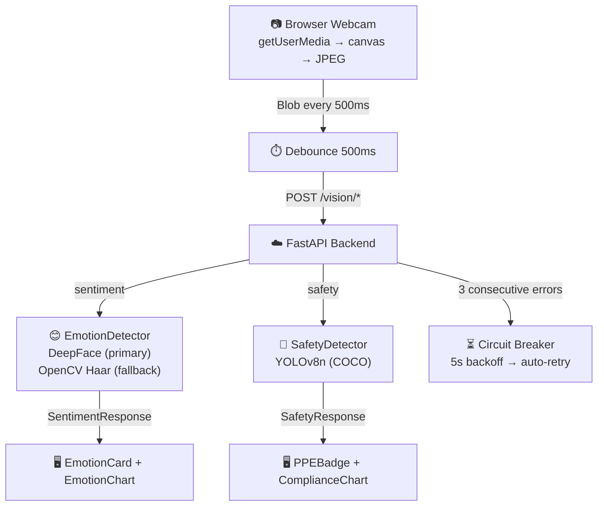

# Huawei Cloud Smart Assistant

> **Status: BETA** — Active development. See [Known Issues](#known-issues) and [Limitations](#current-limitations).

<p align="center">
  
  
  
  
</p>

AI-powered Cloud Operations Assistant for **Huawei Cloud**. Interact via **voice** or **chat** to deploy infrastructure, query resources, manage billing, and execute administrative operations — all through natural language in English or Spanish.



---

## Features

| Category                | Capabilities                                                                     |
| ----------------------- | -------------------------------------------------------------------------------- |
| **Chat Assistant**      | Multi-thread conversations, markdown rendering, inline charts, bilingual (EN/ES) |
| **Voice Assistant**     | Real-time recording, waveform visualization, STT (SIS/Whisper), TTS (Kokoro)     |
| **Sentiment Recognition** | Real-time facial emotion detection via webcam (DeepFace + OpenCV Haar fallback) |
| **Industrial Safety**   | Real-time PPE compliance detection via webcam (YOLOv8n), compliance KPIs        |
| **Cloud Orchestration** | Deploy ECS, VPC, ELB, EIP, SG, OBS, RDS — full HA infra in one prompt            |
| **Resource Discovery**  | 90+ Huawei Cloud services, dynamic schema registry, operation discovery          |
| **Billing**             | Monthly spend, cost-by-service breakdown, multi-month queries                    |

---

## Architecture

### Dual-Path Execution



The **fast path** handles simple queries (list, billing, greetings) with regex matching — no LLM call for routing. The **LangGraph agent** handles complex multi-step operations (deploy, discover, delete).

### LangGraph Agent


- **Max iterations**: 80 | **Memory**: `MemorySaver` (in-memory, per session) | **Rate limiting**: 6 retries (3s backoff) | **Content filter**: 81011 errors auto-retried

---

## Voice Pipeline


| Language | STT                        | TTS Voice  |
| -------- | -------------------------- | ---------- |
| English  | SIS (`english_16k_common`) | `af_bella` |
| Spanish  | Whisper (recommended)      | `af_heart` |

---

## Vision Pipeline



---

## Quick Start

### Requirements

| Requirement         | Version | Notes                                    |
| ------------------- | ------- | ---------------------------------------- |
| **Python**          | 3.12    | 3.14 incompatible with TensorFlow        |
| **Node.js**         | 18+     | Frontend                                 |
| **KooCLI (hcloud)** | Latest  | All cloud operations                     |
| **ffmpeg**          | Any     | Voice transcription                      |

### 1. Clone & Configure

```bash
git clone <repository-url>
cd Huawei-Cloud-Smart-Assistant
```

Create `.env` in the project root (see [Environment Variables](#environment-variables)).

### 2. Backend

```bash
cd backend
python -m venv .venv
.venv\Scripts\activate          # Windows
# source .venv/bin/activate     # Linux/Mac
pip install -r requirements.txt
python -m uvicorn app:app --app-dir backend --reload --host 0.0.0.0 --port 8003
```

### 3. Frontend

```bash
cd frontend
npm install
npm run dev
```

Access at **http://localhost:5173**. Ensure `VITE_API_BASE_URL` in `.env` matches the backend (`http://localhost:8003`).

### 4. KooCLI Setup

```bash
# Download: https://support.huaweicloud.com/intl/en-us/qs-hcli/hcli_02_003.html
hcloud configure set --cli-access-key=YOUR_AK --cli-secret-key=YOUR_SK --cli-region=ap-southeast-3
hcloud ECS NovaListServers --cli-region=ap-southeast-3  # verify
```

### 5. Optional: Vision Dependencies

```bash
pip install deepface tf-keras              # Sentiment (emotion detection)
pip install opencv-python-headless numpy   # Face detection fallback
pip install ultralytics                    # Safety (PPE detection)
```

---

## Environment Variables

| Variable                 | Description                            | Example                          | Required  |
| ------------------------ | -------------------------------------- | -------------------------------- | --------- |
| `HUAWEI_REGION`          | Default Huawei Cloud region            | `ap-southeast-3`                 | Yes       |
| `HUAWEI_PROJECT_ID`      | Project ID for API calls               | `c03f2d01...`                    | Yes       |
| `HUAWEI_AK`              | Access Key ID                          | `HPUAJIZE...`                    | Yes       |
| `HUAWEI_SK`              | Secret Access Key                      | `wE0Md6x1...`                    | Yes       |
| `CLOUD_SDK_DOMAIN_ID`    | Domain ID for RMS SDK                  | `37300593...`                    | For RMS   |
| `HUAWEI_IAM_ENDPOINT`    | IAM endpoint for token auth            | `https://iam.ap-southeast-3...`  | For SIS   |
| `HUAWEI_SIS_ENDPOINT`    | SIS endpoint for STT                   | `https://sis-ext.ap-southeast-3...` | For SIS |
| `HUAWEI_USERNAME`        | IAM username                           | `bs_dev_J50026714`               | For SIS   |
| `HUAWEI_DOMAIN_NAME`     | IAM domain name                        | `bs_dev_J50026714`               | For SIS   |
| `HUAWEI_PASSWORD`        | IAM password                           | `Huawei@123!`                    | For SIS   |
| `MAAS_API_KEY`           | ModelArts API key                      | `oJM6F66Us...`                   | Yes       |
| `MAAS_API_URL`           | ModelArts chat completions URL         | `https://api-ap-southeast-1.modelarts-maas.com/v2/chat/completions` | Yes |
| `OPEN_API_BASE`          | OpenAI-compatible base URL             | `https://api-ap-southeast-1.modelarts-maas.com/openai/v1` | Yes |
| `BACKEND_PORT`           | Backend server port                    | `8003`                           | No        |
| `BACKEND_CORS_ORIGINS`   | Allowed CORS origins                   | `http://localhost:5173`          | No        |
| `VITE_API_BASE_URL`      | Frontend API base URL                  | `http://localhost:8003`          | No        |
| `WHISPER_ASR_URL`        | Whisper ASR endpoint                   | `http://localhost:9000/asr`      | For Whisper |
| `KOKORO_SPEECH_URL`      | Kokoro TTS endpoint                    | `http://localhost:8880/v1/audio/speech` | For TTS |
| `KOKORO_VOICE_ES`        | Spanish TTS voice                      | `af_heart`                       | No        |
| `KOKORO_VOICE_EN`        | English TTS voice                      | `af_bella`                       | No        |
| `KOOLCI_MAX_OUTPUT`      | Max KooCLI output chars                | `500000`                         | No        |

---

## API Endpoints

| Method | Endpoint                  | Description                          |
| ------ | ------------------------- | ------------------------------------ |
| POST   | `/chat`                   | Chat message → AI response           |
| POST   | `/voice`                  | Audio → STT → AI response → TTS     |
| POST   | `/transcribe`             | Audio → STT transcription only       |
| POST   | `/vision/sentiment`       | Image → emotion detection            |
| POST   | `/vision/sentiment/base64`| Base64 image → emotion detection     |
| POST   | `/vision/safety`          | Image → PPE compliance detection     |
| GET    | `/vision/status`          | Vision backends availability         |
| GET    | `/health`                 | Health check                         |
| GET    | `/metrics`                | Observability metrics                |

---

## Tools Reference

41 tools across 12 service groups:

### Query (Read-Only)

| Tool                      | Service | Description                             |
| ------------------------- | ------- | --------------------------------------- |
| `list_ecs`                | ECS     | List all ECS instances                  |
| `describe_ecs`            | ECS     | Get details of a specific ECS           |
| `list_vpcs`               | VPC     | List all VPCs                           |
| `describe_vpc`            | VPC     | Get VPC details                         |
| `list_subnets`            | VPC     | List subnets in a VPC                   |
| `list_elb`                | ELB     | List load balancers                     |
| `describe_elb`            | ELB     | Get ELB details                         |
| `list_eips`               | EIP     | List elastic IPs                        |
| `list_security_groups`    | SG      | List security groups                    |
| `describe_security_group` | SG      | Get security group details              |
| `list_images`             | IMS     | List IMS images                         |
| `find_image_id`           | IMS     | Find image ID by name                   |
| `list_rds`                | RDS     | List RDS instances                      |
| `list_rds_datastores`     | RDS     | List DB engine versions                 |
| `list_rds_flavors`        | RDS     | List RDS flavor specs                   |
| `list_rds_storage_types`  | RDS     | List available storage types            |
| `list_rds_backups`        | RDS     | List RDS backups                        |
| `list_rds_error_logs`     | RDS     | List RDS error logs                     |
| `list_rds_slow_logs`      | RDS     | List slow query logs                    |
| `list_resources`          | RMS     | List all cloud resources (account-wide) |
| `get_monthly_costs`       | BSS     | Get monthly billing summary             |
| `get_cost_by_service`     | BSS     | Get cost breakdown by service           |

### Management

| Tool                | Service | Description                      |
| ------------------- | ------- | -------------------------------- |
| `start_ecs`         | ECS     | Start an ECS instance            |
| `stop_ecs`          | ECS     | Stop an ECS instance             |
| `reboot_ecs`        | ECS     | Reboot an ECS instance           |
| `create_vpc`        | VPC     | Create a new VPC                 |
| `create_eip`        | EIP     | Create an elastic IP             |
| `associate_eip`     | EIP     | Associate EIP to a resource      |
| `release_eip`       | EIP     | Release an elastic IP            |
| `manage_ecs`        | DEPLOY  | Start/stop/reboot/status ECS     |
| `manage_eip`        | DEPLOY  | Create/associate/show/delete EIP |
| `manage_obs_bucket` | DEPLOY  | Create/delete OBS buckets        |

### Deploy (Multi-Step)

| Tool                  | Description                                                                 |
| --------------------- | --------------------------------------------------------------------------- |
| `deploy_ecs_instance` | Creates ECS with auto-resolved VPC/subnet/image/AZ, optional SG             |
| `setup_elb_for_ecs`   | Full ELB stack: ELB → Listener → Pool → Members → EIP                      |
| `create_rds_instance` | Creates RDS with auto-resolved VPC/subnet/SG/AZ, waits for ACTIVE status   |
| `delete_rds_instance` | Deletes an RDS instance by ID                                               |

### Discovery

| Tool                      | Description                                       |
| ------------------------- | ------------------------------------------------- |
| `list_available_services` | Catalog of 90+ Huawei Cloud services              |
| `list_service_operations` | List KooCLI operations for a service              |
| `get_operation_details`   | Get required/optional parameters for an operation |
| `resolve_service_schema`  | Direct schema lookup by service + operation hint  |
| `run_koocli_command`      | Execute any `hcloud` command (use after discovery) |

---

## Huawei Cloud Integration

All cloud operations go through **KooCLI** (`hcloud`). The backend builds CLI arguments, injects credentials, executes via `subprocess.run()`, and parses JSON responses.

| Service | Dedicated Tools                                                   |
| ------- | ----------------------------------------------------------------- |
| **ECS** | `deploy_ecs_instance`, `list_ecs`, `describe_ecs`, `manage_ecs`   |
| **VPC** | `create_vpc`, `list_vpcs`, `list_subnets`, `list_security_groups` |
| **ELB** | `setup_elb_for_ecs`, `list_elb`, `describe_elb`                   |
| **EIP** | `manage_eip`, `list_eips`                                         |
| **IMS** | `list_images`, `find_image_id`                                    |
| **RDS** | `create_rds_instance`, `delete_rds_instance`, `list_rds`, ...     |
| **OBS** | `manage_obs_bucket`                                               |
| **BSS** | `get_monthly_costs`, `get_cost_by_service`                        |
| **RMS** | `list_resources`                                                  |

For any other service: `list_available_services` → `list_service_operations` → `get_operation_details` → `run_koocli_command`.

---

## Models

| Component             | Model                       | Provider                | Notes                               |
| --------------------- | --------------------------- | ----------------------- | ----------------------------------- |
| **Chat/Reasoning**    | `glm-5.2` / `deepseek-v3.2` | Huawei MaaS (ModelArts) | OpenAI-compatible API, main agent   |
| **Intent/Formatting** | `glm-5.2` / `deepseek-v3.2` | Huawei MaaS             | Fast path response formatting       |
| **STT (primary)**     | Huawei SIS                  | Huawei Cloud            | Cloud-based, English/Chinese        |
| **STT (fallback)**    | Whisper                     | Local/self-hosted       | Better Spanish support              |
| **TTS**               | Kokoro                      | Local/self-hosted       | OpenAI-compatible API, EN/ES voices |
| **Emotion Detection** | DeepFace (VGG-Face)         | Local (Python)          | 7-emotion classification            |
| **PPE Detection**     | YOLOv8n (COCO)              | Local (Python)          | 80-class object detection, ~6 MB    |

---

## Performance

| Feature                | Implementation                                                                        |
| ---------------------- | ------------------------------------------------------------------------------------- |
| **Fast path**          | Regex-based routing for simple queries — no LLM call for routing, only for formatting |
| **Cloud cache**        | Thread-safe TTL cache (30s default, 200 entries, LRU eviction)                        |
| **Message pruning**    | Tool results >3000 chars truncated before LLM invocation                              |
| **Rate limiting**      | 6 retries with exponential backoff (3s base) on 429 errors                            |
| **KooCLI timeout**     | 180s per command (configurable)                                                       |
| **Output truncation**  | KooCLI output capped at 500k chars with JSON repair on truncation                      |

---

## Known Issues

| Issue                                                                         | Status |
| ----------------------------------------------------------------------------- | ------ |
| `MemorySaver` is in-memory only — conversation history lost on server restart | Known  |
| Huawei SIS doesn't have Spanish recognition accuracy                          | Known  |
| LLM may lose context in very long conversations (>50 tool calls)              | Known  |
| YOLOv8n COCO model has limited PPE detection accuracy                         | Known  |
| DeepFace incompatible with Python 3.14 (TensorFlow limitation)               | Known  |

---

## Current Limitations

- **No Docker support** | **No API authentication** | **No persistent memory** | **No RAG** | **No streaming responses** | **No multi-cloud**

---

## Troubleshooting

| Problem                        | Solution                                                                      |
| ------------------------------ | ----------------------------------------------------------------------------- |
| `hcloud` not found             | Ensure `hcloud`/`hcloud.exe` is in PATH or project root/bin                  |
| Authentication failed          | Verify `HUAWEI_AK` and `HUAWEI_SK` in `.env`                                 |
| Command timeout                | Increase `KOOLCI_TIMEOUT` in `.env` (default 180s)                            |
| Port already in use            | Change `BACKEND_PORT` in `.env`                                               |
| CORS errors                    | Add frontend URL to `BACKEND_CORS_ORIGINS`                                    |
| `sentiment_backend: unavailable` | Install DeepFace (`pip install deepface tf-keras`) or OpenCV                 |
| `safety_available: false`      | Install ultralytics (`pip install ultralytics`)                                |
| DeepFace import error          | Use Python 3.12 (TensorFlow incompatibility with 3.14)                        |

---